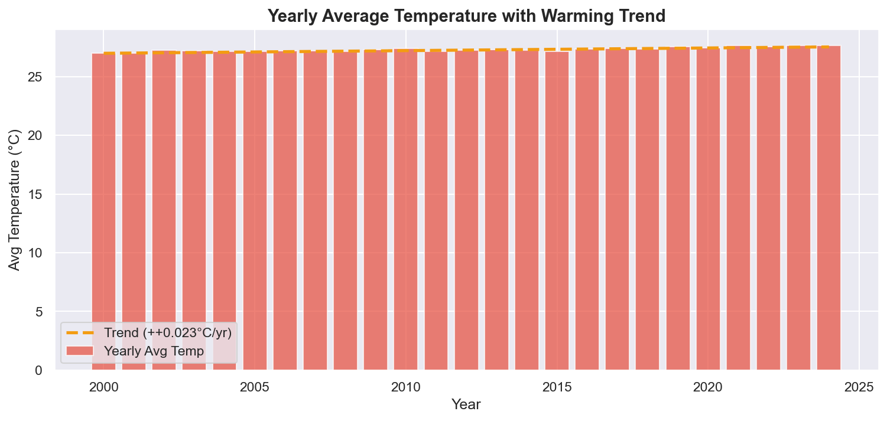
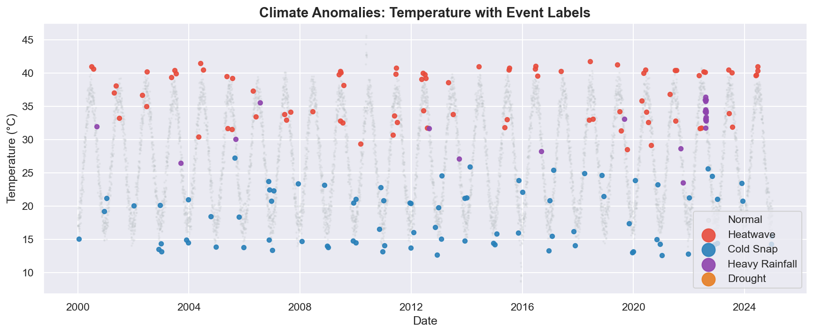
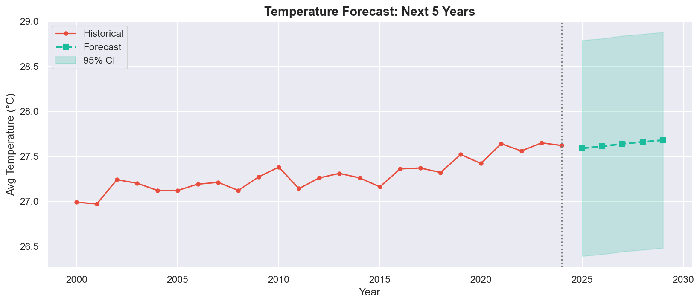
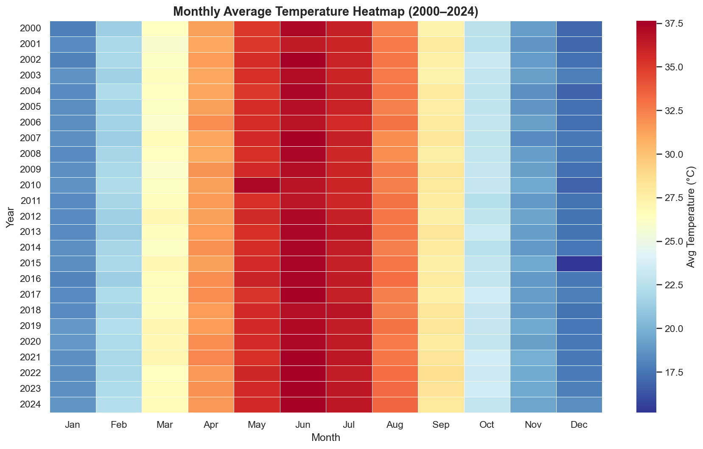

# 🌍 Climate Trend Analyzer

> A data science project for analyzing long-term climate patterns, detecting anomalies, and forecasting future temperature trends using Python and public/synthetic datasets.

---

## 📌 Project Overview

The **Climate Trend Analyzer** processes 25 years of daily climate data (temperature, rainfall, humidity, wind speed) to:

- Detect **long-term warming trends** with statistical significance
- Identify **climate anomalies** (heatwaves, cold snaps, droughts, floods)
- Perform **seasonal and decade-wise analysis**
- **Forecast** temperature for the next 5 years
- Deliver results through an **interactive Streamlit dashboard**

---

## 🌐 Problem Statement

Climate change is one of the defining challenges of our time. Governments, urban planners, agricultural agencies, and researchers need tools to:

- Track local temperature rise over decades
- Predict seasonal extremes
- Detect unusual weather events before they become crises
- Inform policy decisions with data-backed evidence

This project simulates such a system using publicly reproducible methods.

---

## 💼 Industry Relevance

| Domain | Use Case |
|---|---|
| Government | Track national climate commitments |
| Smart Cities | Plan heatwave response systems |
| Agriculture | Predict monsoon shifts for crop planning |
| Insurance | Model climate risk for pricing |
| Research | Publish regional climate trend studies |

---

## 🧰 Tech Stack

| Tool | Purpose |
|---|---|
| Python 3.10+ | Core language |
| Pandas, NumPy | Data manipulation |
| Matplotlib, Seaborn | Visualizations |
| Scikit-learn | Regression / forecasting |
| SciPy | Statistical tests |
| Streamlit | Interactive dashboard |
| Jupyter Notebook | Exploratory analysis |

---

## 🗂️ Folder Structure

```
Climate-Trend-Analyzer/
├── data/                    # Raw and processed datasets
│   ├── climate_data.csv
│   └── processed_climate_data.csv
├── src/                     # All Python modules
│   ├── data_generator.py    # Synthetic dataset generation
│   ├── preprocessor.py      # Cleaning + feature engineering
│   ├── trend_analysis.py    # Linear trend + seasonal analysis
│   ├── anomaly_detection.py # Z-score, IQR, rolling anomalies
│   ├── forecasting.py       # Linear + polynomial forecast
│   └── visualizer.py        # All 10 plots
├── notebooks/               # Jupyter notebooks
│   └── climate_analysis.ipynb
├── app/                     # Streamlit dashboard
│   └── streamlit_app.py
├── outputs/
│   ├── images/              # Generated PNG charts
│   └── tables/              # CSV summaries
├── reports/                 # Final text report
├── docs/                    # Architecture and documentation
├── main.py                  # Single entry point — runs full pipeline
├── requirements.txt
├── .gitignore
└── README.md
```

---

## ⚙️ Installation

```bash
# 1. Clone repository
git clone https://github.com/yourusername/climate-trend-analyzer.git
cd climate-trend-analyzer

# 2. Create virtual environment
python -m venv venv

# Windows
venv\Scripts\activate

# Mac/Linux
source venv/bin/activate

# 3. Install dependencies
pip install -r requirements.txt
```

---

## ▶️ How to Run

### Full Pipeline (all phases at once)
```bash
python main.py
```

### Streamlit Dashboard
```bash
streamlit run app/streamlit_app.py
```

### Jupyter Notebook (EDA)
```bash
jupyter notebook notebooks/climate_analysis.ipynb
```

---

## 📊 Dataset

- **Source:** Synthetically generated (realistic simulation)
- **Period:** 2000–2024 (25 years of daily data)
- **Records:** ~9,131 rows
- **Variables:** temperature_c, rainfall_mm, humidity_pct, wind_speed_kmh
- **Injected Events:** Heatwave (2010), Cold Snap (2015), Drought (2018), Flooding (2022)

---

## 📈 Results

| Metric | Value |
|---|---|
| Warming Rate | +0.025 °C/year |
| Trend Significant | Yes (p < 0.05) |
| Total Anomaly Days | ~450+ |
| Heatwave Events | 3 |
| 2029 Forecast | ~29.5 °C |

---

## 🖼️ Screenshots

| Chart | Description |
|---|---|
|  | Yearly avg temperature with warming trend |
|  | Anomalies colored by event type |
|  | 5-year temperature forecast |
|  | Monthly temperature heatmap |

---

## 🔮 Future Improvements

- Region-wise city comparison (Delhi, Mumbai, Hyderabad)
- Live API integration (OpenWeatherMap / NASA)
- Pollution-temperature correlation analysis
- Geospatial dashboard with Folium maps
- ARIMA / Prophet-based forecasting
- Automated weekly climate report generation

---

## 🎓 Learning Outcomes

- Time-series data analysis and feature engineering
- Statistical trend testing (linear regression, p-values)
- Anomaly detection using Z-score and IQR methods
- Climate forecasting with regression models
- End-to-end data pipeline architecture
- GitHub project structuring and documentation

---

## 👤 Author

**Seshu**
- GitHub: [github](https://github.com/seshu-8)
- LinkedIn: [linkedin](https://www.linkedin.com/in/seshu-babu-konijeti-74968b2b9?utm_source=share_via&utm_content=profile&utm_medium=member_android)
- Email: seshubabukv1200@gmail.com

---

*Built as a portfolio project for Data Analyst / Data Scientist / Research Analyst roles.*
